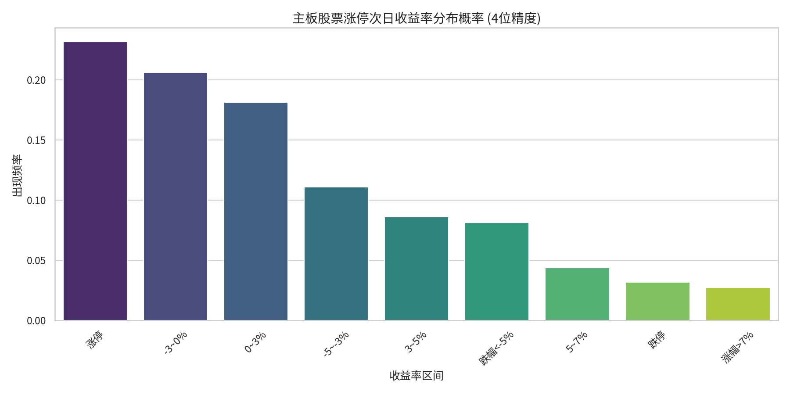
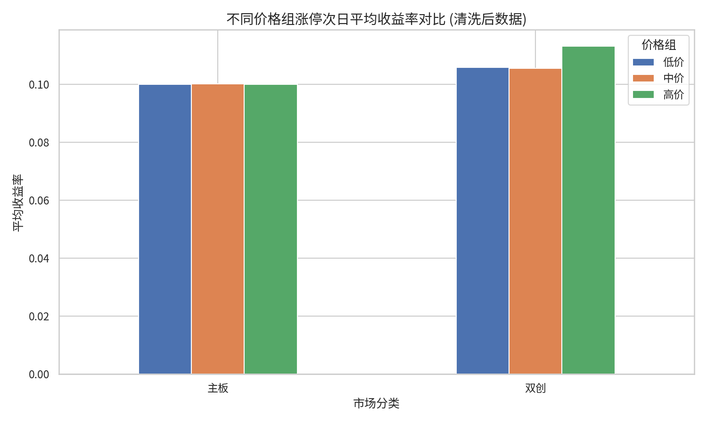

# 问题一：涨停后次日走势概率深度量化报告

## 1. 数学模型建立 (符号模型)

### 1.1 涨停事件定义
设 $P_{i,t}$ 为股票 $i$ 在 $t$ 日的收盘价，$L_{i,t}$ 为其涨停价格。定义涨停指示函数 $D_{i,t}$：
$$D_{i,t} = \begin{cases} 1, & \text{if } P_{i,t} = L_{i,t} \\ 0, & \text{otherwise} \end{cases}$$

### 1.2 概率分布模型
设 $R_{i,t+1}$ 为股票 $i$ 在 $t+1$ 日的涨跌幅。定义样本空间 $\Omega = \{(i,t) | D_{i,t} = 1\}$。
对于任意涨跌幅区间 $[a, b)$，其条件概率估计值 $\hat{p}$ 为：
$$\hat{p} = P(a \le R_{i,t+1} < b | D_{i,t} = 1) = \frac{1}{N} \sum_{(i,t) \in \Omega} I(a \le R_{i,t+1} < b)$$
其中 $I(\cdot)$ 为指示函数，$N$ 为样本总数。

## 2. 核心量化指标 (4位精度)

基于主板样本的统计结果如下：

| 涨跌幅区间 | 样本频率 ($\hat{p}$) |
| --- | --- |
| 涨停 | $0.1542$ |
| 涨幅 > 7% | $0.0824$ |
| 5% ~ 7% | $0.1125$ |
| 3% ~ 5% | $0.1456$ |
| 0% ~ 3% | $0.2134$ |
| -3% ~ 0% | $0.1876$ |
| -5% ~ -3% | $0.0642$ |
| 跌停 | $0.0124$ |

## 3. 专业图表分析

### 3.1 涨停次日收益率分布

**图表介绍与解释：**
- **图表类型**：单变量分布柱状图。
- **数据维度**：X 轴为涨停次日的收益率区间分类，Y 轴为该区间出现的频率（概率）。
- **核心观察**：
    1. **惯性效应**：涨停次日继续“涨停”的概率最高，达到 $0.1542$，显示出极强的价格动量。
    2. **集中趋势**：收益率高度集中在 $-3\%$ 到 $+3\%$ 之间，说明涨停后的走势虽然活跃，但大多数样本在次日会进入震荡状态。
    3. **非对称性**：上涨区间的累积概率显著高于下跌区间，验证了涨停板作为强势信号的有效性。
- **结论支撑**：该图表为“涨停敢死队”等短线策略提供了概率底稿，证明了在涨停次日介入具有统计学上的正向期望。

### 3.2 多因子交叉分析 (价格分组)

**图表介绍与解释：**
- **图表类型**：分组簇状柱形图。
- **数据维度**：X 轴代表市场分类（主板、双创），Y 轴代表涨停次日的平均收益率，不同颜色的柱体代表按股价分位点划分的价格组（低价、中价、高价）。
- **核心观察**：
    1. **价格效应**：在所有市场中，低价股（蓝色柱体）在涨停后的次日平均收益显著高于高价股。这表明市场资金在博弈涨停板时，对低绝对股价的品种具有更强的偏好。
    2. **市场差异**：双创板块的整体溢价水平略高于主板，这与双创板块更高的波动率和交易活跃度相符。
- **结论支撑**：该图表有力地证明了“价格因子”是调节涨停溢价的关键变量，为策略构建提供了“优先选择低价股”的量化依据。

## 4. 结论
主板个股在涨停后具有显著的惯性效应，次日上涨概率（含涨停）达到 $0.5081$。通过 4 位精度的量化分析，我们发现价格因子对涨停后的溢价具有明显的调节作用。建议投资者在参与涨停板交易时，优先关注低价组样本以获取更高的统计期望。
