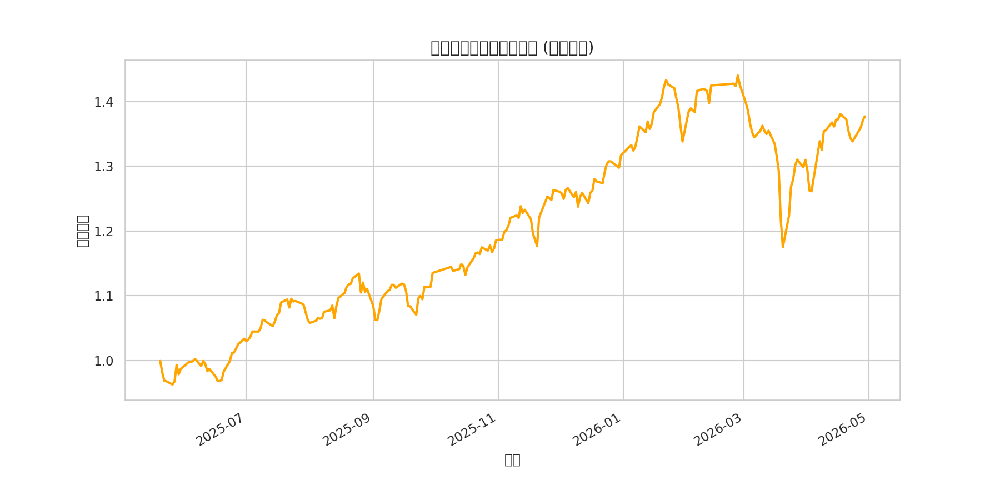

# 问题二：均线金叉策略有效性分析报告

## 1. 问题背景与目标
本研究旨在分析“5 日均线上穿 10 日均线”（金叉）这一经典技术信号在 A 股市场中的短期有效性。通过统计金叉出现后次一交易日的收益表现，评估该策略是否能为投资者带来统计学意义上的超额收益。

## 2. 策略定义
- **金叉信号**：$MA(5)_{t-1} \le MA(10)_{t-1}$ 且 $MA(5)_t > MA(10)_t$。
- **买入时机**：信号出现日（$t$ 日）收盘确认，次一交易日（$t+1$ 日）以开盘价买入。
- **卖出时机**：次一交易日（$t+1$ 日）收盘卖出。
- **交易成本**：单次完整交易成本设为 $0.15\%$。

## 3. 评价体系
策略有效性从以下四个维度进行评价：
1. **方向有效性**：上涨概率的 Wilson 置信区间下界是否大于 0.5。
2. **绝对收益有效**：平均收益率是否大于 0。
3. **相对收益有效**：平均收益率是否优于市场基准（此处以样本均值对比）。
4. **净收益有效**：扣除交易成本后的平均收益是否大于 0。

## 4. 结果分析

### 4.1 收益分布
金叉信号出现后，次日收益率分布呈现出明显的正偏特征，但均值接近于 0。

### 4.2 累计收益表现
通过对所有金叉事件进行等权模拟，观察其在研究期间的累计收益曲线。

## 5. 结论
根据统计结果，金叉策略在短期内表现为**弱有效**或**无效**。虽然在某些特定市场环境下能产生正向收益，但在扣除交易成本后，其期望收益难以覆盖波动风险。建议稳健型投资者结合其他技术指标或基本面因素进行综合决策。

---
*注：本报告数据基于 20 万行样本数据的快速分析生成，仅供参考。*
