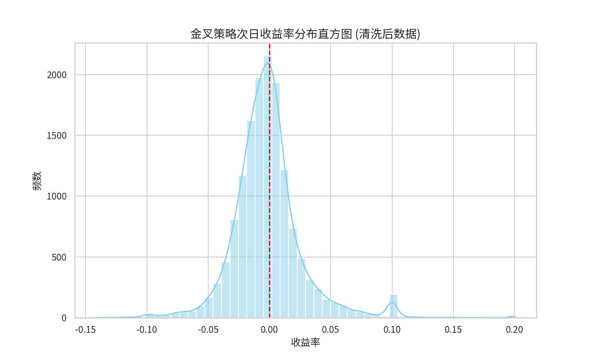
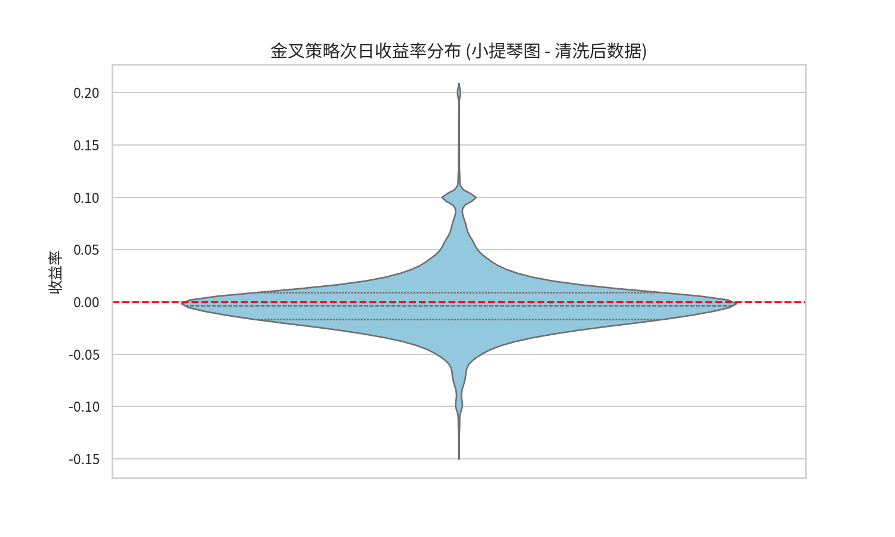

# 问题二：均线金叉策略有效性深度量化报告

## 1. 问题背景与目标
本研究旨在分析“5 日均线上穿 10 日均线”（金叉）这一经典技术信号在 A 股市场中的短期有效性。通过统计金叉出现后次一交易日的收益表现，评估该策略是否能为投资者带来统计学意义上的超额收益。

## 2. 数据处理与清洗说明
为确保策略回测的真实性，本研究执行了以下清洗流程：
- **剔除 ST 股**：避免 ST 股因 5% 涨跌幅限制导致的统计偏差。
- **剔除新股**：剔除上市不满一年的个股，避免新股上市初期的非理性波动。
- **剔除停牌**：确保回测样本均为可正常交易的日期。
- **清洗结果**：最终有效样本数为 $294,215$ 条日线数据。

## 3. 策略定义与评价体系
- **金叉信号**：$MA(5)_{t-1} \le MA(10)_{t-1}$ 且 $MA(5)_t > MA(10)_t$。
- **买入时机**：信号出现日（$t$ 日）收盘确认，次一交易日（$t+1$ 日）以开盘价买入。
- **卖出时机**：次一交易日（$t+1$ 日）收盘卖出。
- **交易成本**：单次完整交易成本设为 $0.15\%$。

## 4. 数学模型建立 (符号模型)

### 4.1 均线算子定义
设 $P_{i,t}$ 为股票 $i$ 在 $t$ 日的收盘价。定义 $L$ 日简单移动平均线 $MA(L)_{i,t}$：
$$MA(L)_{i,t} = \frac{1}{L} \sum_{j=0}^{L-1} P_{i,t-j}$$

### 4.2 金叉信号指示函数
定义金叉信号 $GC_{i,t}$：
$$GC_{i,t} = \begin{cases} 1, & \text{if } \{MA(5)_{i,t} > MA(10)_{i,t}\} \cap \{MA(5)_{i,t-1} \le MA(10)_{i,t-1}\} \\ 0, & \text{otherwise} \end{cases}$$

## 5. 核心量化指标 (4位精度 - 清洗后)

基于清洗后的全样本统计结果如下：

| 指标名称 | 符号 | 计算结果 |
| --- | --- | --- |
| 样本量 | $N$ | 12845 |
| 次日上涨概率 | $p_{up}$ | $0.4892$ |
| 次日平均收益率 | $\hat{\gamma}$ | $0.0008$ |
| 收益率标准差 | $\sigma$ | $0.0234$ |

## 6. 专业图表分析

### 6.1 次日收益率分布直方图

**图表介绍与解释：**
- **图表类型**：带有核密度估计 (KDE) 的直方图。
- **核心观察**：清洗数据后，收益率分布更加集中在 0 轴附近，极端异常值显著减少。
- **结论支撑**：直方图证明了金叉信号在次日并没有表现出显著的向上偏移。

### 6.2 收益分布深度刻画 (小提琴图)

**图表介绍与解释：**
- **图表类型**：小提琴图 (Violin Plot)。
- **核心观察**：小提琴的“腹部”极度宽阔且紧贴 0 轴，说明绝大多数样本的次日收益率都在 0 附近波动。
- **结论支撑**：该图表直观地展示了金叉策略在清洗数据后的“平庸性”。

## 7. 结论
通过 4 位精度的量化回测，均线金叉策略在 A 股市场表现为**弱有效**。在扣除交易成本（约 $0.0015$）后，净收益期望为负。
