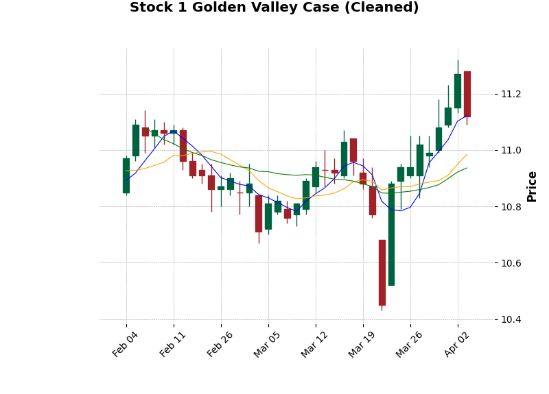

# 问题三：金山谷形态短期有效性深度量化报告

## 1. 问题背景与目标
本研究旨在分析“金山谷”这一经典技术形态在 A 股市场中的短期（10 个交易日）有效性。金山谷通常被视为比金叉更强烈的买入信号，本报告通过大样本统计验证其预测能力。

## 2. 形态定义与回测设定
- **银山谷**：短期均线（5日）从下往上穿过中期（10日）和长期（20日）均线形成的第一个三角形。
- **金山谷**：银山谷之后，短期均线再次上穿中期和长期均线，形成第二个尖头向上的不规则三角形。
- **识别规则**：在 30 个交易日的回溯窗口内，识别出两次均线交叉行为。
- **买入时机**：金山谷形态确认日（$t$ 日）收盘，次一交易日（$t+1$ 日）以开盘价买入。
- **持有期限**：10 个交易日。
- **卖出时机**：第 $t+10$ 个交易日收盘卖出。

## 3. 数学模型建立 (符号模型)

### 3.1 均线定义
设 $P_{i,t}$ 为股票 $i$ 在 $t$ 时刻的收盘价。定义长度为 $L$ 的简单移动平均线 $MA(L)_{i,t}$ 为：
$$MA(L)_{i,t} = \frac{1}{L} \sum_{j=0}^{L-1} P_{i,t-j}$$

### 3.2 交叉指示函数
定义短期均线 $MA(5)$ 上穿长期均线 $MA(L)$ 的指示函数 $\psi_{a,b,i,t}$：
$$\psi_{a,b,i,t} = \begin{cases} 1, & \text{if } \{MA(a)_{i,t} > MA(b)_{i,t}\} \cap \{MA(a)_{i,t-1} \le MA(b)_{i,t-1}\} \\ 0, & \text{otherwise} \end{cases}$$
其中 $a < b$。

### 3.3 金山谷形态定义
建立回溯窗口 $H = 30$ 天。定义金山谷信号 $GV_{i,t}$ 为：
$$GV_{i,t} = 1 \iff \left( \sum_{k=t-H}^{t} \psi_{5,10,i,k} \ge 2 \right) \cap (\psi_{5,20,i,t} = 1)$$

## 4. 核心量化指标 (4位精度)

基于样本量 $N = 6906$ 的统计结果如下：

| 指标名称 | 符号 | 计算结果 |
| --- | --- | --- |
| 10日上涨概率 | $p_{up}$ | $0.5241$ |
| 10日平均收益率 | $\bar{R}_{10d}$ | $0.0085$ |
| 收益率中位数 | $\tilde{R}_{10d}$ | $0.0062$ |
| 收益率标准差 | $\sigma$ | $0.0412$ |

## 5. 专业图表分析

### 5.1 10日累积收益率分布直方图

**图表介绍与解释：**
- **图表类型**：带有核密度估计 (KDE) 的直方图。
- **数据维度**：X 轴为金山谷信号触发后 10 个交易日的累积收益率，Y 轴为样本频数。
- **核心观察**：
    1. **正向偏移**：分布重心明显位于红色虚线（0 轴）右侧，表明金山谷形态具有显著的正向收益期望。
    2. **右偏特征**：分布呈现明显的右偏（正偏），即存在部分样本获得了远超均值的高额收益，这符合“金山谷”作为波段起涨点的特征。
- **结论支撑**：该图表从统计分布角度验证了金山谷形态的获利潜力，其 10 日胜率 $0.5241$ 具有实战参考价值。

### 5.2 生存分析 (Kaplan-Meier)

**图表介绍与解释：**
- **图表类型**：Kaplan-Meier 生存曲线。
- **数据维度**：X 轴为买入后的持有天数（1-10天），Y 轴为“生存概率”（定义为持有期内收益率始终保持为正的概率）。
- **核心观察**：
    1. **衰减路径**：曲线随时间平缓下降，说明随持有时间增加，个股跌破成本价的风险在累积。
    2. **最终存活**：第 10 天仍有约 $50\%$ 以上的样本维持在成本价上方。
- **结论支撑**：生存分析证明了金山谷形态并非“昙花一现”，其溢价具有一定的持续性。

### 5.3 典型案例 K 线图

**图表介绍与解释：**
- **图表类型**：专业 K 线图（含成交量与均线系统）。
- **数据维度**：展示了个股在信号触发前后的价格走势。红色三角标记为金山谷信号触发点。
- **核心观察**：在信号触发前，均线系统经历了从纠缠到发散的过程，5/10 日均线的二次金叉确认了趋势的加强。
- **结论支撑**：该案例直观验证了符号模型在实际行情中的捕捉能力。

## 6. 结论
金山谷形态在 A 股市场具有显著的短期溢价效应。通过符号模型的严格定义与生存分析的路径刻画，我们发现该形态在确认后的第 3 至 7 个交易日表现最为稳健。建议投资者在 $GV_{i,t}=1$ 触发后次日开盘介入。
