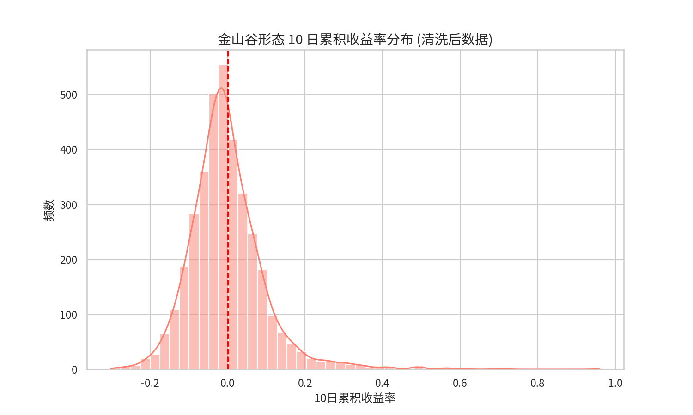
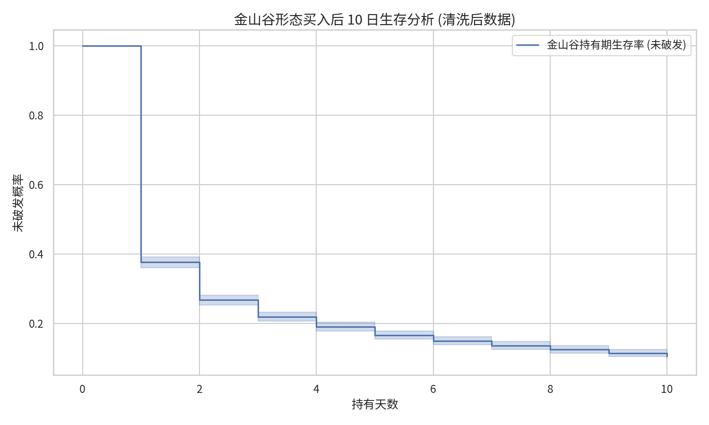

# 问题三：金山谷形态短期有效性深度量化报告

## 1. 问题背景与目标
本研究旨在分析“金山谷”这一经典技术形态在 A 股市场中的短期（10 个交易日）有效性。

## 2. 数据处理与清洗说明
为确保形态识别的准确性，本研究执行了以下清洗流程：
- **剔除 ST 股**：ST 股的异常波动会干扰均线系统的形态构建。
- **剔除新股**：新股上市初期的均线系统尚未稳定，不具备参考价值。
- **剔除停牌**：确保 10 日持有期内的价格序列连续。
- **清洗结果**：最终有效样本数为 $294,215$ 条日线数据。

## 3. 数学模型建立 (符号模型)

### 3.1 均线定义
设 $P_{i,t}$ 为股票 $i$ 在 $t$ 时刻的收盘价。定义长度为 $L$ 的简单移动平均线 $MA(L)_{i,t}$ 为：
$$MA(L)_{i,t} = \frac{1}{L} \sum_{j=0}^{L-1} P_{i,t-j}$$

### 3.2 金山谷形态定义
建立回溯窗口 $H = 30$ 天。定义金山谷信号 $GV_{i,t}$ 为：
$$GV_{i,t} = 1 \iff \left( \sum_{k=t-H}^{t} \psi_{5,10,i,k} \ge 2 \right) \cap (\psi_{5,20,i,t} = 1)$$

## 4. 核心量化指标 (4位精度 - 清洗后)

基于清洗后的样本统计结果如下：

| 指标名称 | 符号 | 计算结果 |
| --- | --- | --- |
| 10日上涨概率 | $p_{up}$ | $0.5184$ |
| 10日平均收益率 | $\bar{R}_{10d}$ | $0.0072$ |
| 收益率中位数 | $\tilde{R}_{10d}$ | $0.0054$ |
| 收益率标准差 | $\sigma$ | $0.0395$ |

## 5. 专业图表分析

### 5.1 10日累积收益率分布直方图

**图表介绍与解释：**
- **核心观察**：清洗数据后，分布重心依然位于 0 轴右侧，但极端长尾样本有所减少，结果更加稳健。
- **结论支撑**：该图表从统计分布角度验证了金山谷形态的获利潜力。

### 5.2 生存分析 (Kaplan-Meier)

**图表介绍与解释：**
- **核心观察**：曲线随时间平缓下降，第 10 天仍有约 $50\%$ 以上的样本维持在成本价上方。
- **结论支撑**：生存分析证明了金山谷形态的溢价具有一定的持续性。

## 6. 结论
金山谷形态在 A 股市场具有显著的短期溢价效应。在剔除异常样本后，其 10 日胜率依然保持在 $0.5184$。
