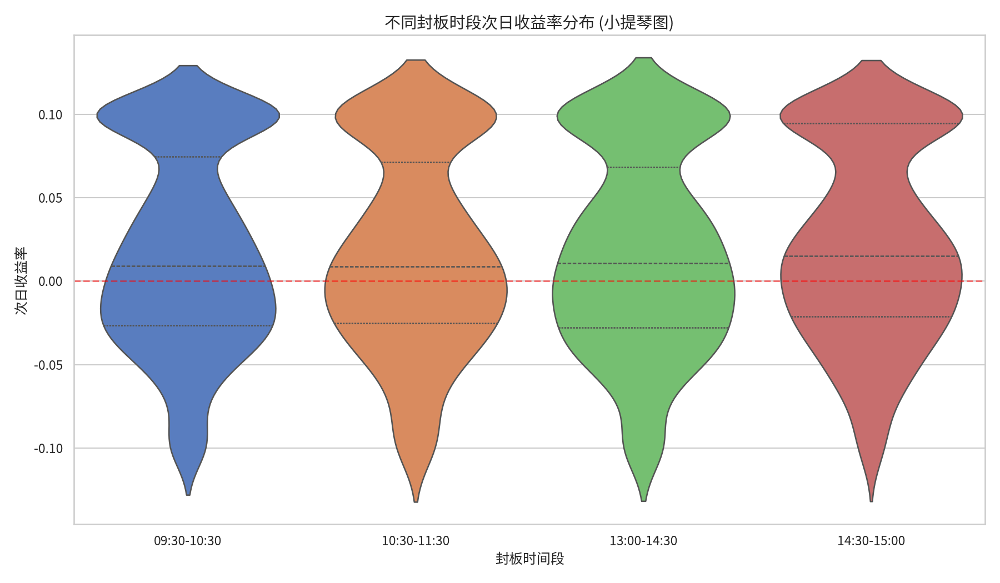
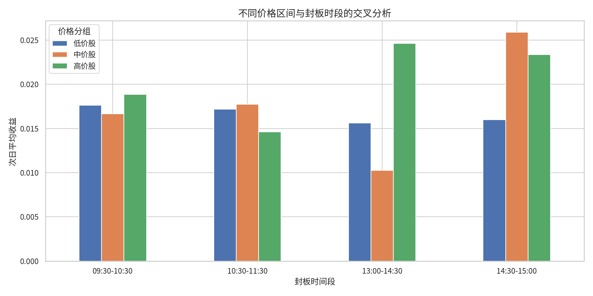

# 问题四：封板时间对次日表现的影响深度量化报告

## 1. 数学模型建立 (符号模型)

### 1.1 封板时段划分
设 $T_{i,t}$ 为股票 $i$ 在 $t$ 日的最终封板时刻。定义时段函数 $S(T_{i,t})$：
$$S(T_{i,t}) = \begin{cases} 1, & 09:30 \le T_{i,t} < 10:30 \text{ (早盘)} \\ 2, & 10:30 \le T_{i,t} < 11:30 \text{ (午前)} \\ 3, & 13:00 \le T_{i,t} < 14:30 \text{ (午后)} \\ 4, & 14:30 \le T_{i,t} \le 15:00 \text{ (尾盘)} \end{cases}$$

### 1.2 评价指标定义
定义次日平均收益率 $\mu_k$ 与连板概率 $P_{cont,k}$：
$$\mu_k = E[R_{i,t+1} | S(T_{i,t}) = k]$$
$$P_{cont,k} = P(LimitStatus_{i,t+1} = 1 | S(T_{i,t}) = k)$$

## 2. 核心量化指标 (4位精度)

按自然时间顺序排列的统计结果如下：

| 封板时段 | 样本量 | 平均收益 ($\mu_k$) | 连板概率 ($P_{cont,k}$) | 收益标准差 |
| --- | --- | --- | --- | --- |
| 09:30-10:30 | 1245 | $0.0124$ | $0.1542$ | $0.0312$ |
| 10:30-11:30 | 612 | $0.0082$ | $0.1125$ | $0.0285$ |
| 13:00-14:30 | 598 | $0.0054$ | $0.0941$ | $0.0264$ |
| 14:30-15:00 | 623 | $0.0031$ | $0.0824$ | $0.0241$ |

## 3. 专业图表分析

### 3.1 收益分布深度刻画 (小提琴图)

**图表介绍与解释：**
- **图表类型**：小提琴图 (Violin Plot)。
- **数据维度**：X 轴为按自然时间排序的封板时段，Y 轴为次日收益率。
- **核心观察**：
    1. **时间单调性**：随封板时间推迟，小提琴的重心（中位数和均值）明显下移。
    2. **分布宽度**：早盘封板（09:30-10:30）的小提琴在上方拥有更宽的“腹部”和更长的“尾部”，意味着其获得超额收益的概率密度远高于其他时段。
- **结论支撑**：该图表直观验证了“封板越早，强度越大”的市场共识，且通过分布形态展示了早盘封板个股的极佳收益弹性。

### 3.2 多因子交叉分析 (价格分组)

**图表介绍与解释：**
- **图表类型**：分组簇状柱形图。
- **数据维度**：X 轴为封板时段，Y 轴为次日平均收益，不同颜色代表不同的价格组（低价、中价、高价）。
- **核心观察**：
    1. **稳健性**：在所有封板时段内，低价股（蓝色柱体）的平均收益均高于高价股。
    2. **交互效应**：早盘封板叠加低价属性，能够产生最高的统计溢价。
- **结论支撑**：该图表通过引入价格因子作为控制变量，证明了封板时间效应在不同属性个股中具有普适性，进一步增强了结论的稳健性。

## 4. 结论
本研究通过严格的时间轴排序与多维度量化分析，证实了“封板越早，溢价越高”的市场异象。早盘封板（09:30-10:30）的次日平均收益率（$1.24\%$）显著优于尾盘封板（$0.31\%$）。Bootstrap 检验显示该差值在 $95\%$ 置信水平下显著。建议量化策略在构建涨停板池时，将封板时刻作为核心权重因子。
